# Aura Railways 🚆

> **Intelligent Railway Journey Planning Engine**  
> Automatically discovers direct and multi-leg connecting train journeys across Indian Railways, calculates transfer windows, accommodates day changes & live delay risks, and protects API secrets server-side.

---

## 🌟 Key Features

- **Intelligent Multi-Leg Routing Engine:**  
  Automatically solves connections ($A \to B \to C$) across major railway interchange junctions (e.g. *Raipur $\to$ Bilaspur/Nagpur/Katni $\to$ Varanasi*) when direct trains are unavailable or unsuitable.
- **Configurable Transfer Buffers:**  
  Enforces configurable minimum transfer windows (15m, 25m, 45m, 60m) to guarantee safe interchanges without risking missed connections.
- **Overnight & Midnight Crossing Math:**  
  Handles multi-day and midnight crossings seamlessly (e.g. 23:50 D1 arrival to 00:30 D2 departure is accurately evaluated as a valid 40m overnight transfer).
- **Live Train Running Status & Delay Risk Recalculation:**  
  Tracks live GPS positions, halts, and delays via RailRadar. Automatically flags journeys as **"Connection at Risk"** if incoming delays erode safe transfer windows.
- **Station Live Boards:**  
  Real-time arrival and departure boards for any station with platform allocations and live delay estimates.
- **Fast Debounced Station Autocomplete:**  
  Resolves station names, codes (e.g. `R`, `BSP`, `BSB`, `NDLS`), partial names, and cities.
- **Guest-First Experience:**  
  Full journey discovery, station lookups, and route comparisons are available immediately without requiring user login.
- **Firebase Auth & Firestore Isolation:**  
  Google Sign-In and Email/Password authentication for saving trips, bookmarking favorite trains/stations, and tracking delay alerts. Production Firestore Security Rules lock all data to `request.auth.uid == userId`.
- **Premium Dark-Glass UI:**  
  Restrained dark-glass aesthetic with translucent surfaces, clear vertical journey timelines, and responsive mobile-first bottom navigation (`Search`, `Trips`, `Live`, `Profile`).

---

## 🛡️ Architecture & Security Boundary

```mermaid
flowchart TD
    Client["Client Browser / Mobile UI"] -->|Internal Route Fetch| API["Aura Backend (/api/* Server Routes)"]
    API -->|User Profile & Saved Trips| Firestore["Firebase Firestore (users/{uid})"]
    API -->|Bearer Secret Header| RailRadar["RailRadar API (https://api.railradar.in/v1)"]
    subgraph Protected Server Boundary
        API
        RailRadar
    end
    style Protected Server Boundary fill:#0f172a,stroke:#38bdf8,stroke-width:2px
```



**Zero Credential Leakage:**
- `RAILRADAR_API_KEY` is strictly managed server-side in `.env.local` (and Vercel Environment Variables in production).
- Secret keys are never bundled, committed, or exposed through client JavaScript or responses.

---

## 🚀 Getting Started

### 1. Prerequisites
- Node.js 18+ (tested on Node 20 / 22 / 26)
- npm or yarn

### 2. Environment Setup
Create `.env.local` in the project root:
```bash
# Server-side API Secret (Never exposed to client)
RAILRADAR_API_KEY=your_railradar_api_key_here
RAILRADAR_BASE_URL=https://api.railradar.in/v1

# Firebase Configuration (Client & Server)
NEXT_PUBLIC_FIREBASE_API_KEY=your_firebase_api_key
NEXT_PUBLIC_FIREBASE_AUTH_DOMAIN=your_project.firebaseapp.com
NEXT_PUBLIC_FIREBASE_PROJECT_ID=your_project_id
NEXT_PUBLIC_FIREBASE_STORAGE_BUCKET=your_project.appspot.com
NEXT_PUBLIC_FIREBASE_MESSAGING_SENDER_ID=your_sender_id
NEXT_PUBLIC_FIREBASE_APP_ID=your_app_id
```

### 3. Install Dependencies & Run
```bash
# Install dependencies
npm install

# Run development server
npm run dev

# Run automated test suite
npm test

# Build for production
npm run build
```

---

## 🧪 Automated Testing

Run the built-in test suite:
```bash
node --test tests/**/*.test.mjs
```
Includes 12 automated unit and integration tests covering:
- Station resolution & canonical code normalization
- Transfer gap & midnight rollover calculation
- Transfer buffer enforcement
- Dynamic delay risk recalculation
- Timezone-safe UTC date math
- Security audit against secret key leakage
- Firestore security rules structure

---

## 📦 Deployment to Vercel

1. Push code to GitHub repository: `riteshsingh2563-ship-it/Aura-Railways`.
2. Import project in the [Vercel Dashboard](https://vercel.com).
3. Under **Settings → Environment Variables**, add:
   - `RAILRADAR_API_KEY` = your RailRadar API key.
4. Deploy!

---

## 📄 License
MIT License
